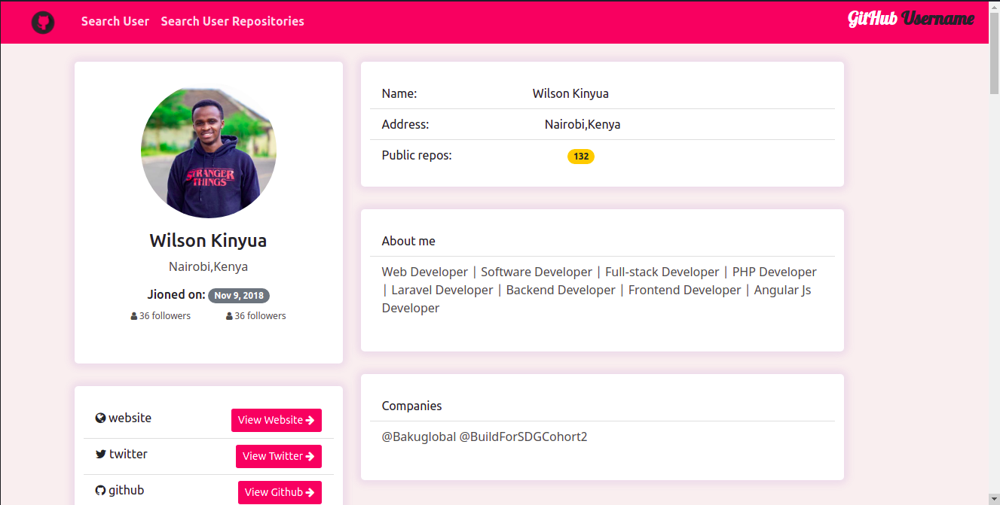
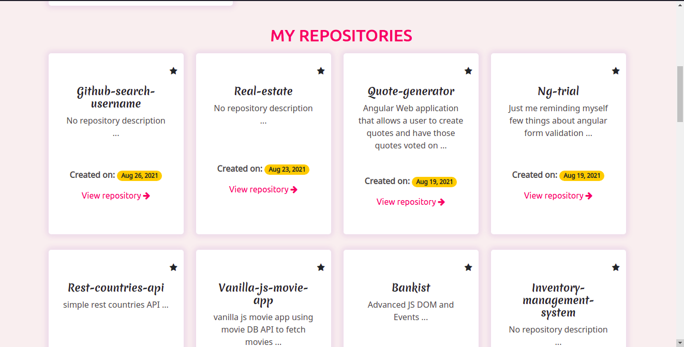
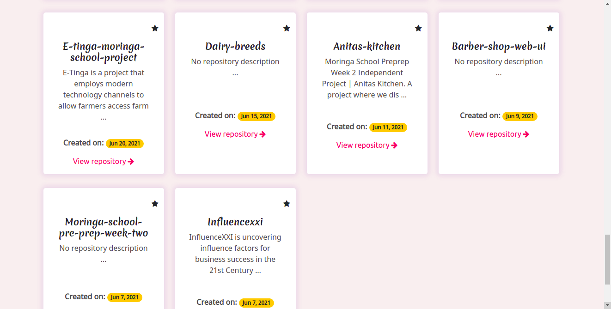
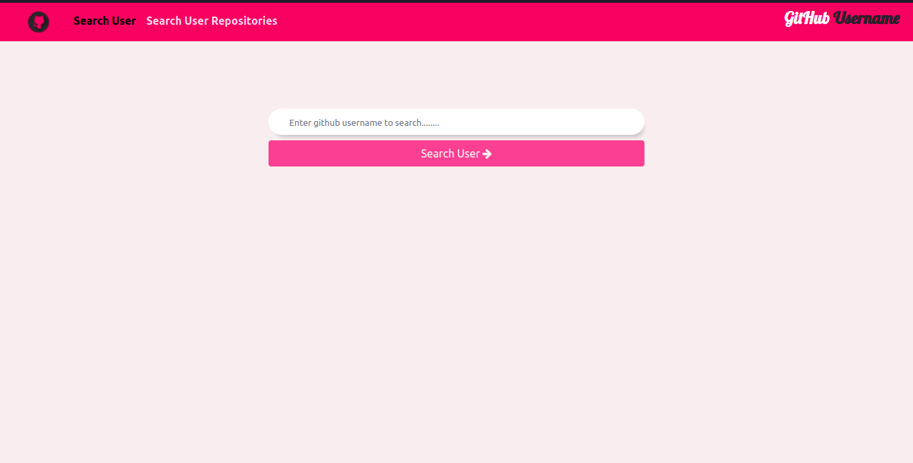
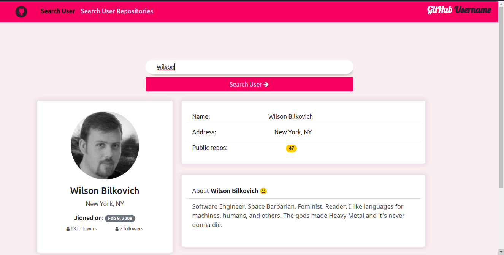
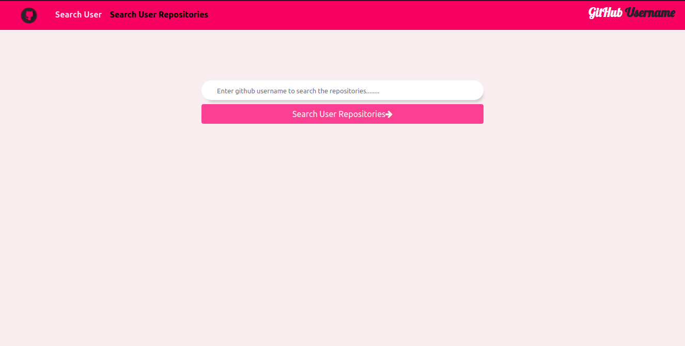
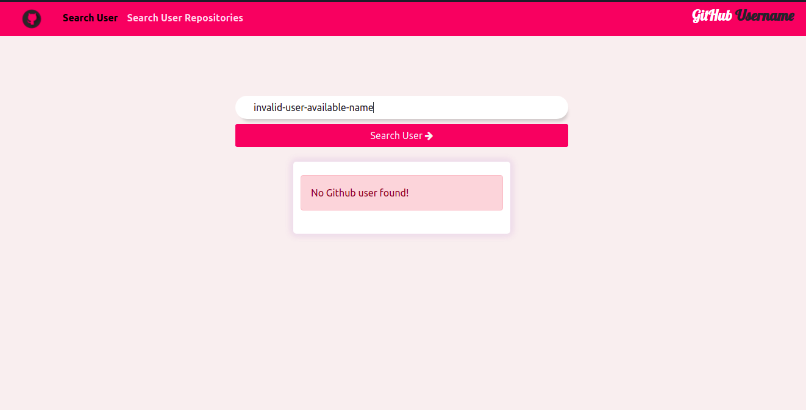
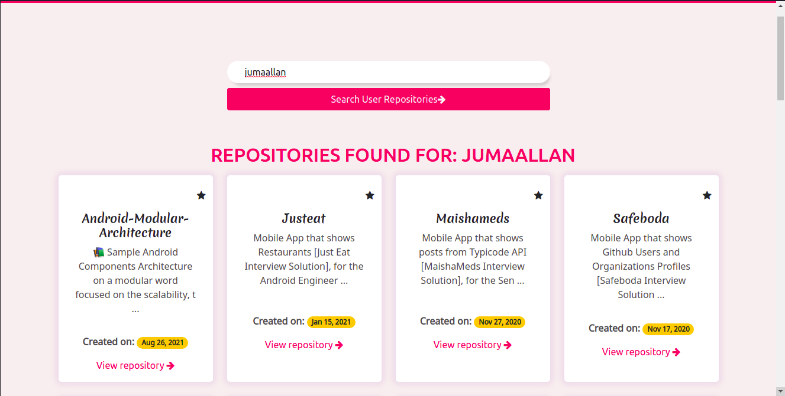
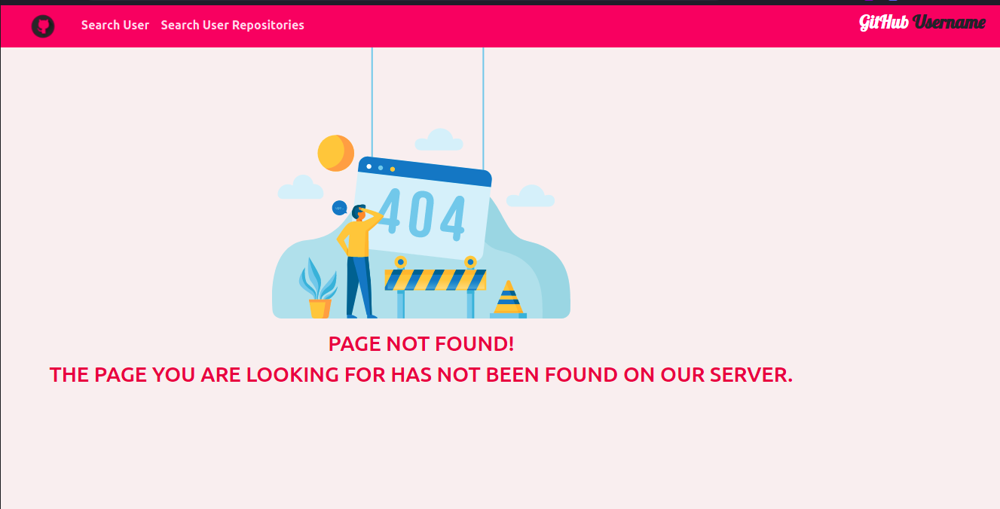
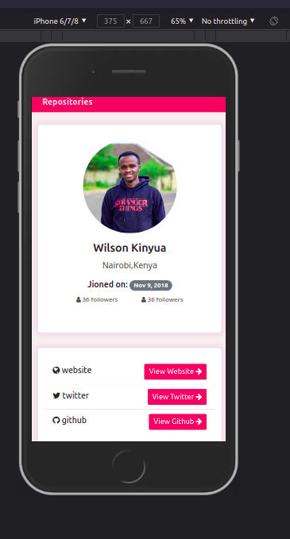

# Github Search Username

#### Created By Wilson Kinyua Muthoni on 28-08-2021

## Description

Week 2 Independent Project | Github Search Username at Moringa School Core (Angular Module). A web application where users can search github users and view their details, can also view repositories of the user and also allows users star repositories they like from the searches.

## Setup Requirements

- Git
- Web-browser or your choice
- Github
- Angular CLI (https://cli.angular.io/)
- Node.js (https://nodejs.org/)
- NPM (https://www.npmjs.com/)

## Setup Installation

- Copy the github repository url
- Clone to your computer
- Open terminal and navigate to the directory of the project you just cloned to your computer
- Run the following command to install all the dependencies

```
npm install
```

- And the following to run development server

```
ng serve
```

- open the browser and navigate to http://localhost:4200/ to see the application in action

## Technologies Used

The following languages have been used on this project:

- HTML
- CSS
- Bootstrap
- Angular CLI

## Setup/Installation Requirements

- Live link to view the project <a href="https://wilsonkinyua.github.io/quote-generator/">View Github Search Username</a>

## Some Screenshots

- Homepage
  

- MY REPOSITORIES SECTION
  

- MY REPOSITORIES SECTION(cont.)
  

- Search Github User Form
  

- Error message if no github user found
  

- Github User search details
  

- Github search User Repositories
  

- Error message if no repositories
  

  - Search for user repositories form
    

  - Github User repositories
    

  - 404 Page(Not found page)
    

  - Fully phone responsive
    <br>
    

## Known Bugs

So far so good there are no bugs related to this project 😎

## Support and contact details 🙂

To make a contribution to the code used or any suggestions you can click on the contact link and email me your suggestions.

- Email: wilson@developerwilson.com
- Phone: +254717255460

## License

Copyright (c) 2021 Moringa school

Permission is hereby granted, free of charge, to any person obtaining a copy
of this software and associated documentation files , to deal
in the Software without restriction, including without limitation the rights
to use, copy, modify, merge, publish, distribute, sublicense, and/or sell
copies of the Software, and to permit persons to whom the Software is
furnished to do so, subject to the following conditions:

The above copyright notice and this permission notice shall be included in all
copies or substantial portions of the Software.

THE SOFTWARE IS PROVIDED "AS IS", WITHOUT WARRANTY OF ANY KIND, EXPRESS OR
IMPLIED, INCLUDING BUT NOT LIMITED TO THE WARRANTIES OF MERCHANTABILITY,
FITNESS FOR A PARTICULAR PURPOSE AND NONINFRINGEMENT. IN NO EVENT SHALL THE
AUTHORS OR COPYRIGHT HOLDERS BE LIABLE FOR ANY CLAIM, DAMAGES OR OTHER
LIABILITY, WHETHER IN AN ACTION OF CONTRACT, TORT OR OTHERWISE, ARISING FROM,
OUT OF OR IN CONNECTION WITH THE SOFTWARE OR THE USE OR OTHER DEALINGS IN THE
SOFTWARE.
